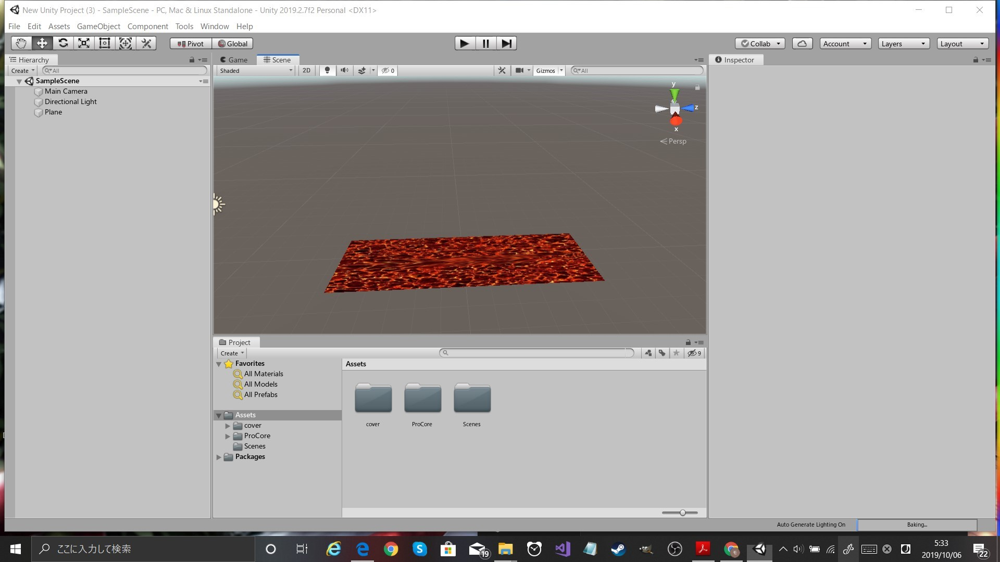
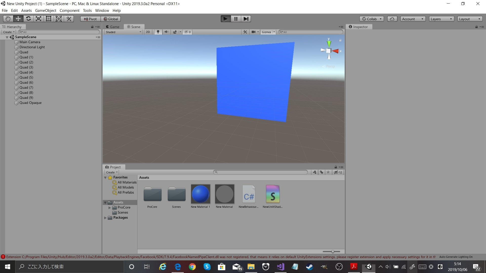

# 第3回：基本的な機能

授業で作成したプロジェクトファイルをforkしたプロジェクトに上げてください。

今回は、3つのテーマを実装してもらいます。各フォルダにそれぞれのプロジェクトのファイルを入れてください。
.gitignore を反映させて、無駄なファイルをアップロードしないようにしてください。

自信のある結果画像をそれぞれのフォルダにresult.pngという名前で保存すること

データの著作権にも気を付けてください。
